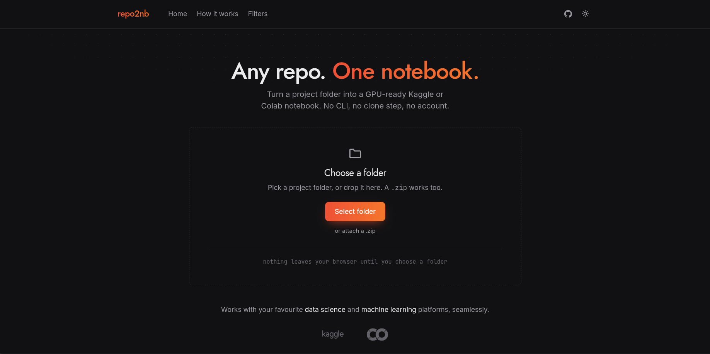
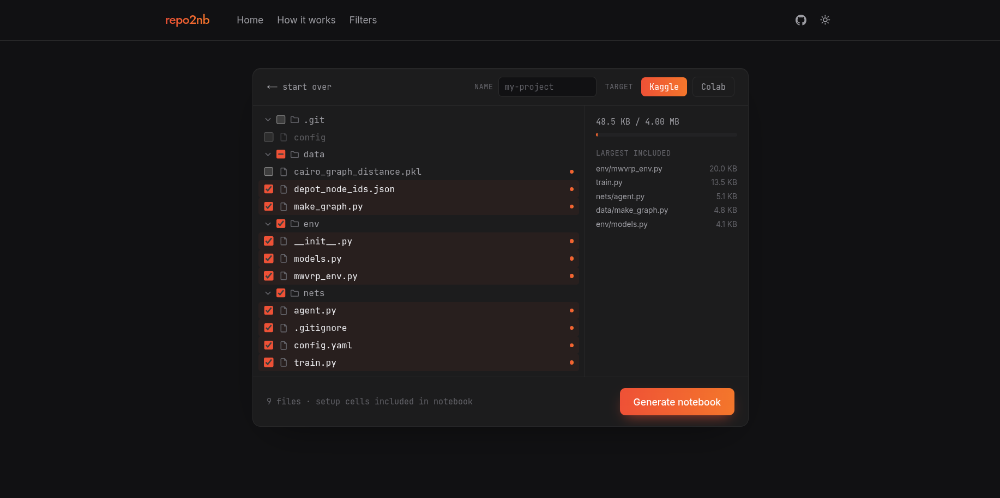
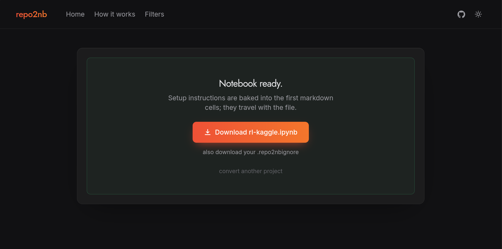

# repo2nb

Upload any repository to Kaggle and Colab to utilize the power of their GPU resources.

Pick a project folder in the browser, review the filtered file tree (with live size
budgeting), and download a ready-to-run `.ipynb`. Nothing leaves your browser until you
choose a folder, and files are processed in memory for a single request — never stored.

## Privacy: it works offline

The whole conversion engine runs in your browser via WebAssembly (Pyodide), and a
service worker caches the app after your first visit. Load the site once, go offline,
and convert with airplane mode on: scan, filtering, and notebook generation all happen
locally. If the offline engine is unavailable (old browser), it falls back to the
server API, where files are processed in memory for one request and never stored.
No third-party network requests are made at any point; analytics is cookieless and
carries only anonymous counters.

## Screenshots

**Landing: the tool is the hero**



**Review the file tree with a live 4 MB budget bar, largest-files panel and notebook name**



**Download the generated notebook**



## What goes into the notebook

The web UI generates the same notebooks as [repo2nb-cli](https://github.com/):

1. **Usage banner**: run all once to reconstruct the repo, then run cells individually
2. **Phase 1 — Git auth & setup** (if the project has `.git`): GitHub token via platform
   secrets (Kaggle Secrets / Colab Secrets), `git init`, remote setup, `git pull origin main`
3. **Setup**: `%pip install` of your dependencies (parsed from requirements.txt /
   pyproject.toml / poetry.lock; falls back to AST import scanning)
4. **Phase 2 — Repository construction**: `%%writefile` cells recreate every selected
   source file in the working directory
5. **Phase 3 — Your workspace**: git cheat sheet and ready-to-uncomment push commands

## Structure

```
packages/repo2nb_core   # pure-Python engine: scanner, deps parsing, notebook generator
apps/web                # Next.js UI + FastAPI backend (api/index.py)
  api/                  # /api/scan, /api/generate, /api/rules — same code local & Vercel
```

## Run locally

Requires Node 20+, pnpm 10+, Python 3.11+, and `uv`.

```sh
# terminal 1 — API
cd apps/web
uv venv .venv && uv pip install -r api/requirements.txt -e ../../packages/repo2nb_core
.venv/bin/uvicorn api.index:app --reload --port 8000

# terminal 2 — UI
cd apps/web
pnpm install
pnpm dev
```

## Deploy

Push to GitHub → import into Vercel with **Root Directory** = `apps/web`, and set the
**Build Command** override to:

```sh
bash vercel-build.sh
```

That copies the engine into `api/vendor/` (Vercel's uv sandbox rejects requirements
paths outside the function dir) before running `next build`. The Python function is
picked up automatically; no env vars needed.

## Tests / checks

```sh
cd packages/repo2nb_core && uv run pytest && uv run ruff check .
cd apps/web && pnpm lint && pnpm typecheck && pnpm build
```

